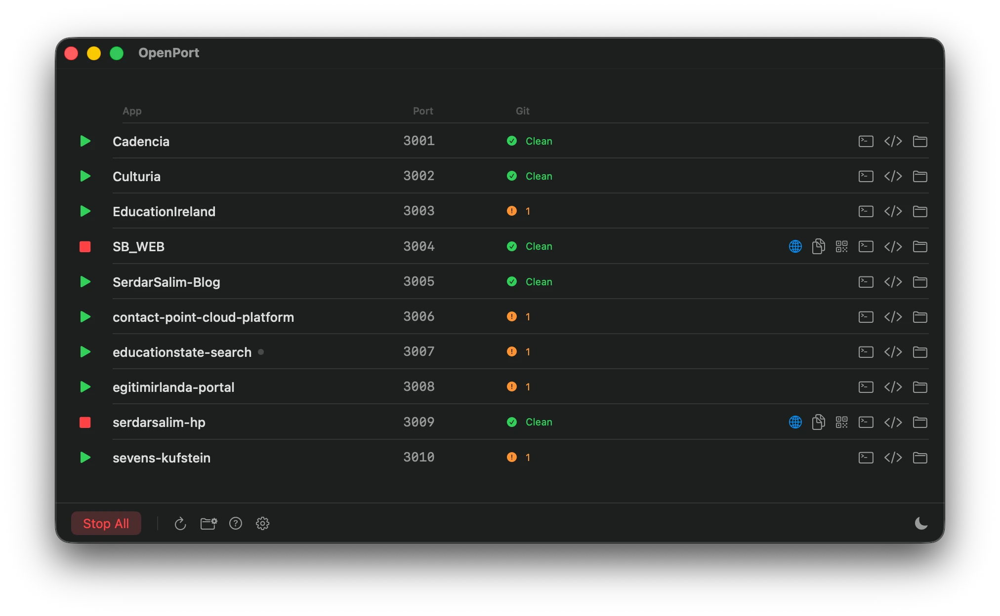

# OpenPort — Dev Manager

**Free, open source macOS app.** Point it at your projects folder and get a one-click dashboard for all your dev servers — no terminal, no account, no subscription.



---

## Download

**[⬇ Download for macOS](https://github.com/serdarsalim/openport/releases/latest/download/openport-macos.zip)** — unzip, double-click, done.

**[🌐 Website](https://serdarsalim.com/openport)** — full details and screenshots.

> First launch: macOS will warn "unidentified developer" because the app isn't signed with a paid Apple Developer certificate. Right-click the app → **Open** → **Open** to get past it. macOS only asks once.

**Requirements:** macOS 14 (Sonoma) or later · [Node.js](https://nodejs.org) installed

---

## What it does

If you work on multiple web projects, you know the routine: cd into a folder, remember which port it uses, open a terminal tab, run `npm run dev`, repeat for every project. OpenPort replaces all of that.

Point it at the folder that holds all your projects (`~/my-portfolio`, `~/code`, wherever). It scans for any project with a `dev` script and shows them in a dashboard. Start a server with one click. Stop it with one click. That's the core.

On top of that:

- **In-app terminal tabs** — click the terminal icon on any row to open a real shell tab inside OpenPort, cd'd into that project. The `+` in the tab bar opens a fresh shell in `$HOME`. No more alt-tab dance to Terminal.app.
- **Context-aware search** — the title-bar search filters apps when you're on the Dashboard and finds-in-scrollback when you're on a terminal tab, with ▲▼ to jump between matches. Per-tab query memory.
- **Terminal profiles** — Settings → Terminal lets you pick a theme (System, Dark, Light, Solarized Dark/Light, Dracula, Nord) and font size. Applies live to every open terminal.
- **Live port detection** — sees every dev server bound on your machine, not just the ones it started. If you started Vite in a terminal on a random port, it shows up on the right row with the actual port.
- **Multi-port awareness** — apps that bind to multiple ports (frontend + backend, HMR, debug) show a green dot — click it for the full list with command lines.
- **"Other ports in use"** — separate section at the bottom for dev servers running outside your portfolio. System processes (Tailscale, ssh tunnels, ControlCenter, Mac apps) are filtered out so you can't accidentally kill them.
- **Live logs viewer** — resizable modal with stdout + stderr from any running app, search filter, auto-scroll, copy, clear. No more switching to a terminal to read the output.
- **Reliable kill** — stops nuke the entire process tree (npm + next + convex + esbuild) instead of just the wrapper. Quitting OpenPort properly reaps its children. A startup orphan-reaper sweeps any zombies left over from previous sessions.
- **Customizable rows** — hide any of the 7 action buttons (browser, copy, QR, logs, terminal, VS Code, Finder) per-row in Settings.
- **go/ links** — type `http://go/myapp` in any browser to open a project, like internal tools at tech companies. Optional, one-time system setup.
- **Git status** — see uncommitted changes for every project without opening a terminal.
- **QR codes** — scan to open a running project on your phone over local Wi-Fi.
- **Menu bar quick launch** — start or stop any server from the menu bar without opening the main window.
- **What's new** — discreet blue dot on the Settings gear when there are new app changes, hidden once seen.
- **Works with Next.js, Vite, Nuxt, Express, Remix, Convex, and anything else that uses `npm run dev`**

---

## Requirements

- macOS 14 (Sonoma) or later
- [Node.js](https://nodejs.org) installed (the app runs `npm run dev` under the hood)
- Projects need a `"dev"` or `"dev:frontend"` script in their `package.json`

---

## Build from source

No Xcode needed.

```bash
git clone https://github.com/serdarsalim/openport.git
cd openport
./build-app.sh
open "dist/OpenPort.app"
```

---

## First time setup

On first launch the app asks you to pick your **portfolio root folder** — the folder that contains all your projects. Example: if your projects live at `~/my-portfolio/cadencia`, `~/my-portfolio/yummii`, etc., pick `~/my-portfolio`. The app remembers this.

To change it later, open **Settings** (gear icon in the footer) → **General** → **Portfolio folder** → **Change…**.

---

## The dashboard

Once your folder is selected, the app scans it and lists every project that has a `"dev"` script.

### Each row shows

| Column | What it means |
|--------|--------------|
| **▶ / ■** | Play to start, stop to stop. Green = can start, red = running |
| **App** | Project folder name |
| **go/ link** | Browser shortcut alias (when go/ links are enabled in Settings) |
| **Port** | The port it runs on — grey when free, orange when taken by another process |
| **● dot next to port** | Appears when the app is bound to multiple ports OR has a backend script. Click for the full list with command lines |
| **Git** | Clean = no uncommitted changes · number = uncommitted file count (hover for detail) |
| **Action icons** | Browser, copy URL, QR code, live logs, terminal, VS Code, Finder |

### Action icons

| Icon | What it does |
|------|-------------|
| 🌐 Globe | Opens the project in your browser |
| 📋 Clipboard | Copies the network URL (`192.168.x.x:PORT`) for other devices on the same Wi-Fi |
| ⬛ QR | Shows a QR code — scan with your phone to open the project instantly |
| 🔍 Logs | Opens a resizable live logs modal with stdout + stderr, search, auto-scroll, copy, clear |
| `>_` Terminal | Opens a new terminal tab inside OpenPort, cd'd into the project (toggle to use Terminal.app instead in Settings → Terminal) |
| `</>` Code | Opens in VS Code |
| 📁 Folder | Opens in Finder |

Globe, clipboard, QR, and logs only appear when the project is running. **Hide any icon you don't use** in Settings → Action buttons.

---

## Detected ports

OpenPort detects what's actually listening on your machine, not just what it started. On every refresh it scans every `$USER`-owned listening TCP socket and matches them back to projects by working directory.

**Detached state.** If you started an app in a terminal — or it's still running from before — the row flips to detached on refresh. The orange port number switches to the *actual* port it's bound to, and the stop button works on that real process. Your assigned port stays saved underneath, so the next Play uses it again.

**Multi-port apps.** Common for apps that run a frontend + backend (Next + Convex) or use HMR / inspector ports. The green dot next to the port column tells you there's more — click for the full list with each command line.

---

## "Other ports in use"

A separate section appears at the bottom of the list when something is listening that doesn't match a known project — usually a dev server you started in a terminal from a folder outside your portfolio.

Each row shows the cwd, port, and full command. The stop button signals SIGTERM. When the cwd is outside your portfolio root, you get a confirmation dialog before killing.

**System processes are filtered out** so you can't accidentally kill them: Tailscale, ssh tunnels, ControlCenter, rapportd (Continuity), Mac apps, OpenPort itself, and anything in `/System`, `/usr`, `/Library`, `/Applications`.

**Stop All never touches this section** — it only stops projects in the main list.

---

## Terminal tabs

OpenPort has built-in terminal tabs so you can run shell commands without leaving the app.

**Open a tab** by clicking the terminal icon on any row (drops you in that project's folder) or the **+** in the tab bar (opens a fresh shell in `$HOME`). Each tab runs your login shell (`$SHELL`, defaults to `/bin/zsh`). Type `exit` or click the **✕** on the tab to close — closing kills the shell and any of its children.

**Theme + font size** in Settings → Terminal → *Terminal profile*. Pick from System, Dark, Light, Solarized Dark, Solarized Light, Dracula, or Nord. Font size 10–20pt. Changes apply live to every open tab.

**Find in terminal.** When a terminal tab is active, the title-bar search becomes find-in-terminal — type to highlight matches in the scrollback, ▲▼ to jump.

**Use Terminal.app instead.** Settings → Terminal → *Use external Terminal.app* reverts the row's terminal button to launching macOS Terminal.app like before.

> Why not run dev servers in tabs? They already have a *Live logs* viewer (the magnifier-on-document icon). Running servers can't accept input anyway — the tab would be read-only with no advantage.

---

## Live logs viewer

Click the magnifier-on-document icon on any running row. Opens a resizable modal showing the app's stdout + stderr, polled live every 500ms.

- **Search** — filter lines as you type. Footer shows match count.
- **Auto-scroll** — toggle in the footer. On = jumps to newest. Off = stays put while logs stream.
- **Copy** — copy the entire visible buffer to clipboard.
- **Clear** — wipe the in-memory buffer for that app.
- **Buffer** — capped at 1000 lines per app.

Only available for apps started by OpenPort (we need to own the output pipes). To debug an app that's already running externally, stop it and re-start it from inside OpenPort.

---

## Ports

Each project gets a port assigned automatically (starting at 3001). The assignment is saved and stays consistent across restarts.

**To change a port:**
- Click the port number to edit it (only works when the server is stopped)
- Type a new number and press Enter, or scroll the mouse wheel to nudge ±1
- The nudge skips ports already assigned to other projects

Port turns **orange** when another process on your machine is already using it. Click play to get a kill-and-retry prompt, or change the port first.

---

## go/ links

go/ links let you type `http://go/alias` in any browser to open a project instantly — the same way internal tools work at tech companies.

### How to enable

1. Open **Settings** (gear icon in the footer)
2. Toggle **go/ links** on
3. Click **Setup System** — this runs a one-time setup that requires your password

The setup adds `127.0.0.1 go` to `/etc/hosts` and installs a port forwarder as a LaunchDaemon so `http://go/alias` works system-wide, in any browser, even after a restart.

### How to set an alias

When go/ links are enabled, each row shows a **go/ link** column. Click the alias text to edit it inline. Default alias is the project folder name lowercased.

Example: project `SerdarSalim-Blog` gets `go/serdarsalim-blog` by default. Change it to `go/blog` and `http://go/blog` opens that project.

---

## Settings

Open Settings from the gear icon in the footer. Settings opens as a draggable, resizable window with a sidebar.

| Section | Contains |
|---------|---------|
| **General** | Portfolio folder (with Change… button), Launch at startup, Menu bar quick launch |
| **go/ links** | Toggle the feature on, run the one-time system setup |
| **Terminal** | Use external Terminal.app toggle, theme picker (System / Dark / Light / Solarized Dark/Light / Dracula / Nord), font size slider (10–20pt) — applies live to all open tabs |
| **Rows** | Per-icon visibility for the 7 row action buttons (browser, copy, QR, logs, terminal, VS Code, Finder) |

**What's new** lives in the bottom-left of every Settings tab. The blue dot on the gear icon in the main window footer tells you when there's something unread.

---

## Help

The Help window (? icon in the footer) is its own draggable window with a sidebar table of contents and a search filter. 12 sections covering every feature.

---

## Menu bar quick launch

When enabled in Settings, a network icon appears in your menu bar. Click it to see all your projects with colored indicators (green = can start, red = running) and start or stop any of them directly from the menu. The dropdown also has **Show OpenPort**, **What's new**, and **Quit**.

---

## QR codes

When a server is running, click the QR icon in its row. Scan the code with your phone and it opens the project on your device over your local network — no copy-pasting needed.

---

## Network URL

The clipboard icon copies a URL like `http://192.168.1.42:3001`. Paste it into any browser on your phone, tablet, or another laptop on the same Wi-Fi.

> Some dev servers (particularly Next.js) need to be configured to listen on `0.0.0.0`. Add `--hostname 0.0.0.0` to your dev script if another device can't connect.

---

## Footer buttons

| Button | What it does |
|--------|-------------|
| **Stop All** | Stops every running dev server in the main list (including their multi-port siblings). Never touches "Other ports in use" |
| **↺ Refresh** | Re-scans your folder, port detection, and git status (⌘R). The spinner next to it lights up while a scan is in flight |
| **?** | Help (separate draggable window) |
| **⚙ Settings** | Settings (separate draggable window). A blue dot on the gear means there's a new What's new entry waiting |
| **☀/🌙** | Toggle light / dark mode |

---

## Background mode

Closing the window doesn't quit the app. Running dev servers keep going. Reopen from the Dock or the menu bar icon (if quick launch is on).

---

## Troubleshooting

**"No apps found"**
Projects need a `"dev"` or `"dev:frontend"` script in `package.json`. Check that the folder you picked is the right root and that at least one project has either script defined.

**A project won't start**
Make sure `node` and `npm` are installed and accessible. The app looks for npm in `/opt/homebrew/bin` and `/usr/local/bin`. If you use `nvm`, set a default: `nvm alias default <version>`. The Live logs button (🔍) shows the actual error.

**Port is orange**
Another process owns that port. Click play and accept the kill-and-retry prompt, or change the port number, or kill it manually: `lsof -ti :PORT | xargs kill`.

**Logs button is missing**
Only appears for apps started in OpenPort. Stop any external copy and re-start it from inside the app to capture output.

**Detected port doesn't match my project**
OpenPort matches by cwd. If the cwd reported by `lsof` doesn't equal your portfolio path exactly (symlinks, subfolders), it'll appear in *Other ports in use* instead of attaching to the row.

**go/alias doesn't work in the browser**
Make sure you ran Setup System in Settings (one-time, requires password). Use `http://go/alias` with the `http://` prefix — browsers won't resolve bare `go/alias` without it.

**Git status shows nothing or wrong info**
The project folder must be a git repo (`git init` must have been run). The app runs `git status --porcelain` to count uncommitted changes.

**"Unidentified developer" warning on launch**
Right-click the app → Open → Open. macOS only asks once.

---

## Rebuilding after changes

```bash
./build-app.sh
```

The new app lands in `dist/OpenPort.app`. Quit the old one and open the new one.
